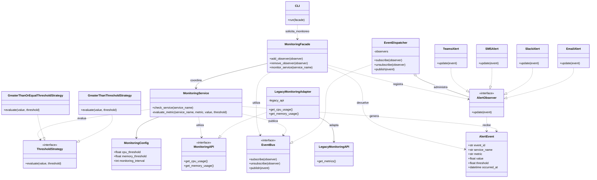

# Diagrama UML – Sistema de monitoreo de microservicios
## Arquitectura en capas con notificaciones basadas en eventos

```mermaid
classDiagram

    class MonitoringConfig {
        +float cpu_threshold
        +float memory_threshold
        +int monitoring_interval
    }

    class AlertEvent {
        +str event_id
        +str service_name
        +str metric
        +float value
        +float threshold
        +datetime occurred_at
    }

    class MonitoringAPI {
        <<interface>>
        +get_cpu_usage()
        +get_memory_usage()
    }

    class ThresholdStrategy {
        <<interface>>
        +evaluate(value, threshold)
    }

    class GreaterThanThresholdStrategy {
        +evaluate(value, threshold)
    }

    class GreaterThanOrEqualThresholdStrategy {
        +evaluate(value, threshold)
    }

    class EventBus {
        <<interface>>
        +subscribe(observer)
        +unsubscribe(observer)
        +publish(event)
    }

    class AlertObserver {
        <<interface>>
        +update(event)
    }

    class MonitoringService {
        +check_service(service_name)
        -evaluate_metric(service_name, metric, value, threshold)
    }

    class EventDispatcher {
        -observers
        +subscribe(observer)
        +unsubscribe(observer)
        +publish(event)
    }

    class MonitoringFacade {
        +add_observer(observer)
        +remove_observer(observer)
        +monitor_service(service_name)
    }

    class LegacyMonitoringAPI {
        +get_metrics()
    }

    class LegacyMonitoringAdapter {
        -legacy_api
        +get_cpu_usage()
        +get_memory_usage()
    }

    class EmailAlert {
        +update(event)
    }

    class SlackAlert {
        +update(event)
    }

    class SMSAlert {
        +update(event)
    }

    class TeamsAlert {
        +update(event)
    }

    class CLI {
        +run(facade)
    }

    EventDispatcher ..|> EventBus

    GreaterThanThresholdStrategy ..|> ThresholdStrategy
    GreaterThanOrEqualThresholdStrategy ..|> ThresholdStrategy

    LegacyMonitoringAdapter ..|> MonitoringAPI

    EmailAlert ..|> AlertObserver
    SlackAlert ..|> AlertObserver
    SMSAlert ..|> AlertObserver
    TeamsAlert ..|> AlertObserver

    MonitoringService --> MonitoringConfig
    MonitoringService ..> MonitoringAPI : utiliza
    MonitoringService ..> ThresholdStrategy : evalua
    MonitoringService ..> EventBus : publica
    MonitoringService ..> AlertEvent : genera

    EventDispatcher o-- AlertObserver : administra
    AlertObserver ..> AlertEvent : recibe

    LegacyMonitoringAdapter --> LegacyMonitoringAPI : adapta

    MonitoringFacade --> MonitoringService : coordina
    MonitoringFacade ..> EventBus : utiliza
    MonitoringFacade ..> AlertObserver : registra
    MonitoringFacade ..> AlertEvent : devuelve

    CLI ..> MonitoringFacade : solicita_monitoreo
```